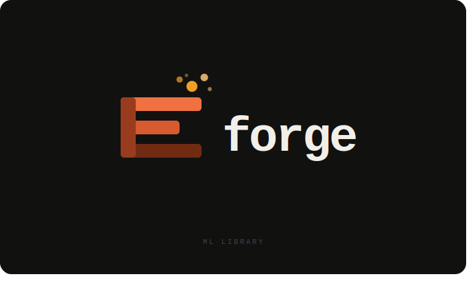

<div align="center">



<br/>

[](https://www.python.org/downloads/)
[](LICENSE)
[](https://numpy.org)
[](https://pytest.org)

**Handbuilt ML library in pure NumPy**

No shortcuts, no black boxes - just the math.

</div>

---

**Forge** is a hand-built machine learning library, a ground-up NumPy implementation of the algorithms that power modern ML. No shortcuts, no black boxes. Every line of code is readable, tested, and designed to show exactly how the math becomes software.


## Quick Start

```bash
git clone https://github.com/Charly21r/forge.git
cd forge
python -m venv .venv && source .venv/bin/activate
pip install -e ".[dev]"
```

```python
import numpy as np
from forge.tree import DecisionTreeClassifier
from forge.neighbors import KNNClassifier
from forge.clustering import KMeans
from forge.naive_bayes import GaussianNB

# --- Decision Tree ---
X = np.array([[0, 0], [0, 1], [1, 0], [1, 1]])
y = np.array([0, 1, 1, 0])

clf = DecisionTreeClassifier(max_depth=3).fit(X, y)
print(clf.predict([[0, 0], [1, 1]]))        # [0 0]
print(clf.feature_importances_)             # per-feature Gini gain

# --- KNN ---
X = np.array([[0.0], [0.5], [1.0], [1.5], [2.0]])
y = np.array([0, 0, 1, 1, 1])

knn = KNNClassifier(k=3).fit(X, y)
print(knn.predict([[0.1], [1.9]]))          # [0 1]

# --- K-Means ---
X = np.random.randn(300, 2)
km = KMeans(n_clusters=3, random_state=0).fit(X)
print(km.labels_)                           # cluster assignments

# --- Gaussian Naive Bayes ---
from sklearn.datasets import load_iris
X, y = load_iris(return_X_y=True)
gnb = GaussianNB().fit(X, y)
print(gnb.score(X, y))                      # ~0.96
```

## API Design

Forge follows the **scikit-learn estimator protocol** same `fit` / `predict` / `score` interface, same naming conventions, same chaining semantics:

```python
# method chaining
acc = DecisionTreeClassifier(max_depth=5).fit(X_train, y_train).score(X_test, y_test)

# parameter inspection
clf.get_params()      # {'criterion': 'gini', 'max_depth': 5, ...}
clf.set_params(max_depth=10)

# fitted attributes end with _
clf.classes_
clf.feature_importances_
clf.n_features_
```

See [API_STANDARDS.md](API_STANDARDS.md) for the full design spec.

## Testing & Coverage

```bash
# run full suite with coverage
pytest

# or explicitly
pytest --cov=forge --cov-report=html
```

The test suite covers basic functionality, edge cases, input validation, `NotFittedError` guards, and numerical consistency against scikit-learn on standard datasets.

## Benchmarks

```bash
python benchmarks/knn_vs_sklearn.py
python benchmarks/tree_vs_sklearn.py
```

Forge aims for within 2× of sklearn's speed on single-estimator workloads (sklearn uses Cython; we use pure NumPy). The gap narrows significantly with vectorised distance computations.

## Project Structure

```
forge/
├── forge/
│   ├── base/              # BaseEstimator, mixins
│   ├── clustering/        # KMeans
│   ├── metrics/           # accuracy_score, distance functions
│   ├── naive_bayes/       # GaussianNB
│   ├── neighbors/         # KNNClassifier
│   ├── tree/              # DecisionTreeClassifier
│   ├── utils/             # validation, probability helpers
│   └── exceptions.py      # NotFittedError, InvalidMetricError
├── tests/
├── examples/
├── benchmarks/
├── API_STANDARDS.md
└── pyproject.toml
```

## Design Philosophy

> *"No shortcuts. No black boxes. Just numpy."*

- **Readable over clever** — implementations follow the textbook algorithm, not micro-optimised tricks
- **Fail loudly** — custom exceptions (`NotFittedError`, `InvalidMetricError`) instead of silent wrong answers
- **sklearn-compatible** — drop-in replacement for `sklearn.tree.DecisionTreeClassifier` in most pipelines
- **Fully typed** — complete `NDArray` type hints, `mypy`-clean
- **Zero magic** — no meta-programming, no dynamic dispatch; the code is what it does

## License

BSD 3-Clause — see [LICENSE](LICENSE).
